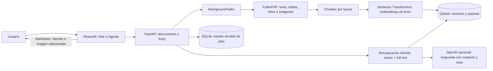

# Sistema RAG Multimodal

Demo de un asistente de consulta para manuales PDF. La API extrae bloques de texto, tablas e imágenes con PyMuPDF; agrupa texto según bloques y cercanía espacial; genera embeddings de texto multilingües; recupera contexto por similitud y términos exactos; y devuelve citas de archivo/página con la imagen más cercana cuando existe.

## Arquitectura



La API coordina los adaptadores de almacenamiento, embeddings y generación. Qdrant persiste el índice; SQLite mantiene el progreso de ingesta entre reinicios. Para un despliegue con varias réplicas, se debe reemplazar `BackgroundTasks` por una cola durable (Celery/RQ) y SQLite por PostgreSQL/Redis, además de compartir almacenamiento de archivos.

## Decisiones técnicas

- **Chunking por layout:** conserva los límites de bloque, ordena por coordenadas, respeta saltos verticales y combina bloques hasta un tamaño objetivo. Tablas extraídas se representan como filas de texto. Cada fragmento conserva página y bounding box.
- **Contexto visual:** se extraen las imágenes embebidas, se guardan por documento y se asocian al bloque textual espacialmente más cercano. Si `OPENAI_API_KEY` está configurada, se describen hasta 30 imágenes por documento con el modelo de visión (`ENABLE_IMAGE_CAPTIONS=true`), y esas descripciones se indexan en el mismo espacio textual. La UI muestra la imagen junto a su cita. Sin clave, se usan texto cercano y coordenadas; no se calculan embeddings de píxeles.
- **Recuperación híbrida:** Qdrant ejecuta búsqueda semántica y una consulta filtrada por términos exactos; sus rankings se fusionan con Reciprocal Rank Fusion. Antes de generar, se limpian tablas y se quitan fragmentos casi duplicados.
- **Control de alcance:** solo pasa contexto a la respuesta si hay coincidencia léxica suficiente o similitud semántica alta con términos compartidos. Ajusta `MIN_SEMANTIC_SCORE` en `.env` si el filtro queda demasiado estricto o permisivo.
- **Resumen del documento:** preguntas generales como “¿de qué trata el PDF?” usan una búsqueda de temas y objetivo del documento, en vez del filtro de coincidencia de una pregunta específica. No adjuntan imágenes al resumen.
- **Embeddings:** Sentence Transformers multilingüe local evita enviar documentos al proveedor de generación. El modelo se descarga al primer arranque y usa un espacio vectorial de 384 dimensiones.
- **Generación:** OpenAI es opcional. Sin `OPENAI_API_KEY`, se devuelven los fragmentos y fuentes; si el proveedor falla se conserva el contexto recuperado. La llamada tiene timeout y reintentos con backoff.
- **Privacidad/costo visual:** al habilitar captions, las imágenes y un extracto del texto cercano se envían al proveedor de visión durante la ingesta. Se limita el número por PDF; desactiva `ENABLE_IMAGE_CAPTIONS` para no enviarlas.
- **Respuestas de respaldo:** si el LLM falla, se extrae una frase pertinente del mejor fragmento en lugar de volcar todo el contexto; la interfaz presenta aparte una advertencia con la causa probable.
- **Ingesta:** `BackgroundTasks` y SQLite hacen la demo sencilla y durable para una instancia. No es un broker distribuido ni garantiza reintento automático tras caída del proceso.

## Requisitos y ejecución

### Docker Compose (recomendado)

1. Copia `.env.example` como `.env` y añade una clave de OpenAI si quieres generación de respuestas. Sin clave, la búsqueda y las fuentes siguen disponibles.
2. Ejecuta `docker compose up --build`.
3. Abre la UI en <http://localhost:8501> y la documentación de API en <http://localhost:8000/docs>.

La primera construcción descarga dependencias y el primer inicio descarga el modelo de embeddings. Qdrant escucha en `localhost:6333`. Esta versión usa una colección Qdrant nueva (`multimodal_rag_v2`) para no mezclar los chunks viejos; vuelve a subir los PDF que quieras consultar.

### Ejecución local

Requiere Python 3.11+ y un servidor Qdrant disponible.

```powershell
python -m venv .venv
.\.venv\Scripts\Activate.ps1
pip install -r requirements.txt
Copy-Item .env.example .env
$env:QDRANT_HOST = "localhost"
uvicorn app.main:app --app-dir backend --reload
```

En otra terminal:

```powershell
pip install -r frontend/requirements.txt
$env:API_URL = "http://localhost:8000"
streamlit run frontend/app.py
```

### Pruebas unitarias

```powershell
pip install -r requirements-dev.txt
pytest -q
```

Las pruebas aíslan el motor RAG con dobles de embeddings, vector store y LLM; el chunker se prueba sin servicios externos.

## Uso de la API

- `POST /documents/upload` con `multipart/form-data` (`file`): devuelve `job_id` (202).
- `GET /documents/jobs/{job_id}`: estado, progreso, resumen o error.
- `POST /rag/search` con `{"query":"...", "top_k":5}`: fragmentos y referencias visuales.
- `POST /rag/query` con el mismo cuerpo: respuesta y fuentes citables.
- `GET /health`: salud de la API.

La ingesta acepta PDF de hasta 30 MB, extrae PDF con texto seleccionable y requiere al menos un bloque textual. Normaliza entidades HTML y acentos agudos separados que aparecen en algunas extracciones PDF. Los documentos escaneados necesitan OCR (por ejemplo, Tesseract), que todavía no está incluido. Las imágenes guardadas se sirven desde `/media/` para la demo.

## Calidad y siguientes pasos

La estructura separa rutas, servicios, entidades e infraestructura. Para extender a producción: añadir pruebas unitarias con mocks para Qdrant/LLM, OCR opcional, captions/visión para diagramas, cola de trabajo durable, autenticación, cuotas por usuario, eliminación/versionado de documentos, observabilidad y evaluación de recuperación (Recall@k/MRR) con un conjunto de preguntas etiquetadas.