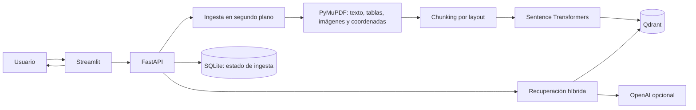

# Sistema RAG Multimodal

Asistente para consultar manuales técnicos en PDF mediante preguntas en lenguaje natural. Procesa texto, tablas e imágenes; recupera fragmentos relevantes y presenta respuestas con referencias al archivo y la página.

## Demo

El repositorio incluye [`Manual_Bomba_BC-200.pdf`](Manual_Bomba_BC-200.pdf) como documento de ejemplo. Al iniciar el proyecto, súbelo desde la barra lateral de la aplicación y espera a que la ingesta llegue a `COMPLETED`.

Preguntas sugeridas para probarlo:

- `¿De qué trata el manual?`
- `¿Cuáles son los componentes principales de la bomba?`
- `¿Qué muestra el esquema de la bomba?`
- `¿Cómo se prepara sushi?` La respuesta debe indicar que el manual no contiene información suficiente.

## Arquitectura



FastAPI separa las rutas HTTP del servicio RAG y de las integraciones mediante interfaces. Qdrant almacena los vectores y sus metadatos; SQLite conserva el estado de los trabajos de ingesta. Docker Compose levanta la API, el frontend y Qdrant.

## Funcionalidades

- **Ingesta asíncrona:** la API devuelve un `job_id` y permite consultar el progreso y resultado del procesamiento.
- **Extracción multimodal:** PyMuPDF extrae texto, tablas, imágenes y coordenadas espaciales de cada página.
- **Chunking por layout:** agrupa bloques cercanos y conserva límites, página y bounding box. Las tablas se representan como texto.
- **Contexto visual:** asocia una imagen con el fragmento espacialmente más cercano y la muestra en las fuentes. Con `OPENAI_API_KEY` y `ENABLE_IMAGE_CAPTIONS=true`, describe e indexa captions de imágenes durante la ingesta.
- **Recuperación híbrida:** combina similitud semántica y coincidencias de términos con Reciprocal Rank Fusion; elimina resultados casi duplicados.
- **Respuestas fundamentadas:** el generador usa el contexto recuperado, incorpora citas de archivo y página, y se abstiene si no encuentra respaldo suficiente. El historial reciente ayuda a resolver preguntas de seguimiento.
- **Respaldo ante fallos:** si OpenAI no está configurado o no responde, el sistema presenta una respuesta extractiva y conserva las fuentes recuperadas.

## Decisiones y límites conocidos

- Sentence Transformers genera embeddings de texto localmente. No se crean embeddings de píxeles; las imágenes se relacionan con el texto mediante proximidad espacial y, opcionalmente, captions generadas por visión.
- OpenAI es opcional para generar respuestas. Si se habilitan captions, las imágenes y parte del texto cercano se envían al proveedor durante la ingesta; desactiva `ENABLE_IMAGE_CAPTIONS` para evitarlo.
- `BackgroundTasks` y SQLite son adecuados para una demo en una sola instancia, pero no forman una cola distribuida. Para múltiples réplicas o un volumen alto de documentos, conviene migrar a una cola durable, almacenamiento compartido y una base de datos de trabajos como PostgreSQL/Redis.
- Los PDF escaneados requieren OCR, que no está incluido.

## Requisitos

- Docker Desktop instalado y en ejecución, con Docker Compose.
- Una clave de OpenAI es opcional. Sin ella funcionan la ingesta, la recuperación y las respuestas extractivas; las captions de imágenes no se generan.

No necesitas instalar Python en tu equipo, crear un entorno virtual ni ejecutar `pip install` para iniciar la aplicación. Docker instala las dependencias dentro de los contenedores.

## Inicio con Docker

Desde la raíz del repositorio, en PowerShell:

```powershell
Copy-Item .env.example .env
```

Si quieres usar OpenAI, agrega tu clave a `OPENAI_API_KEY` en `.env`. Conserva ese archivo local y no lo publiques en GitHub.

Construye e inicia los servicios:

```powershell
docker compose up --build -d
docker compose ps
```

Abre la aplicación y los servicios:

- Frontend: <http://localhost:8501>
- Documentación interactiva de la API: <http://localhost:8000/docs>
- Salud de la API: <http://localhost:8000/health>

La primera construcción descarga dependencias y el primer arranque descarga el modelo multilingüe de embeddings. Sube `Manual_Bomba_BC-200.pdf` desde la barra lateral; el PDF no se indexa automáticamente.

Para revisar los logs:

```powershell
docker compose logs -f api
```

Para detener los servicios sin borrar los documentos ni el índice persistidos:

```powershell
docker compose down
```

## API

- `POST /documents/upload`: carga un PDF y devuelve un `job_id`.
- `GET /documents/jobs/{job_id}`: consulta estado, progreso, resultado o error de la ingesta.
- `POST /rag/search`: busca fragmentos y referencias asociadas.
- `POST /rag/query`: genera una respuesta basada en las fuentes recuperadas.
- `GET /health`: comprueba el estado de la API.

La carga acepta archivos PDF de hasta 30 MB y requiere texto seleccionable. Las imágenes extraídas se sirven desde `/media/`.
